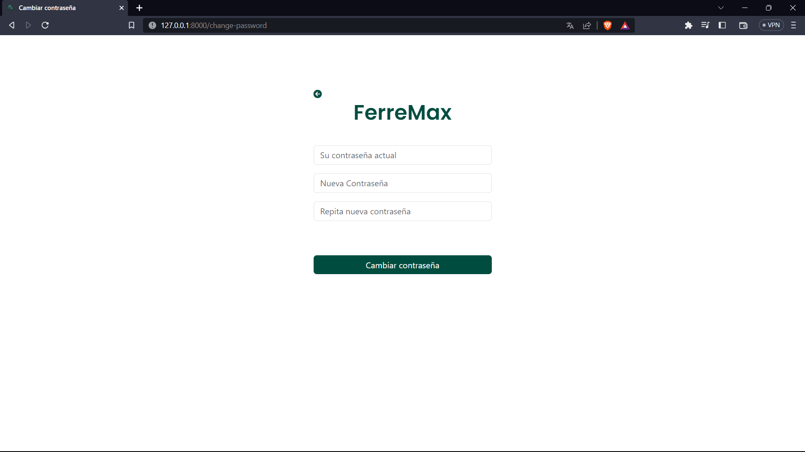

# Ferremax 🪛

Ferremax is a web platform designed to streamline the efficient management of a hardware store. Developed using the powerful ***Django framework***, Ferremax provides an intuitive and accessible interface for managing and showcasing the products offered by the hardware store.

## Features  ⚙️
### Product Management 🛠️
Ferremax allows users to easily upload and update the products available in the hardware store. Through a user-friendly interface, users can add detailed information such as name, description, category, price, and more.

### Shopping Cart 🚛
Ferremax includes an intuitive and user-friendly shopping cart, allowing customers to select desired products and make convenient purchases. Customers can review their cart, adjust quantities, and proceed with the checkout process.

### Favorites List ❤️
Ferremax offers you the option to create a favorites list where you can save the products that interest you the most. This feature allows you to personalize your shopping experience by providing easy access to your preferred products, saving you time and facilitating decision-making. Organize and manage your favorites with Ferremax and enjoy an even more convenient and personalized shopping experience.

### Search and Filtering 🔍
Ferremax provides search and filtering options for customers to quickly find desired products. Users can search by name, category, minimum and maximum price, and sort the results, thus enhancing the shopping experience and customer satisfaction.

### Email Communication 📧
Ferremax also facilitates email communication, enabling users to express their inquiries through the contact form. Additionally, users have the option to receive notifications about new products and promotions. This feature ensures effective communication and keeps users informed about the latest updates.

### Users 👩‍🦰🧑
- Register 🚪

- Login 🔑

- Change password 🔐

